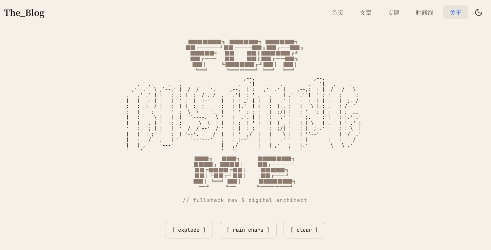
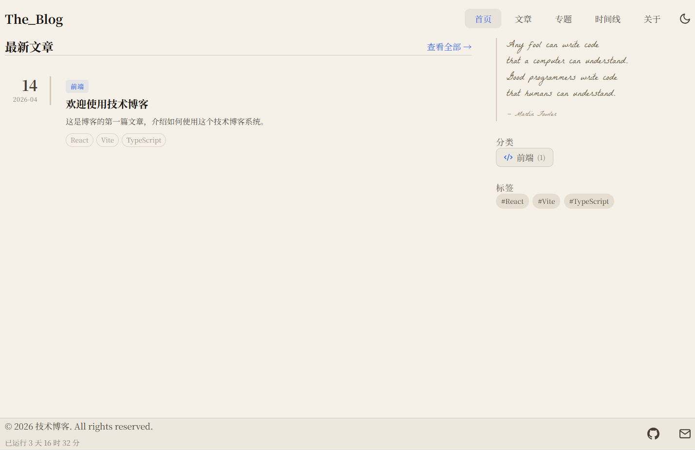
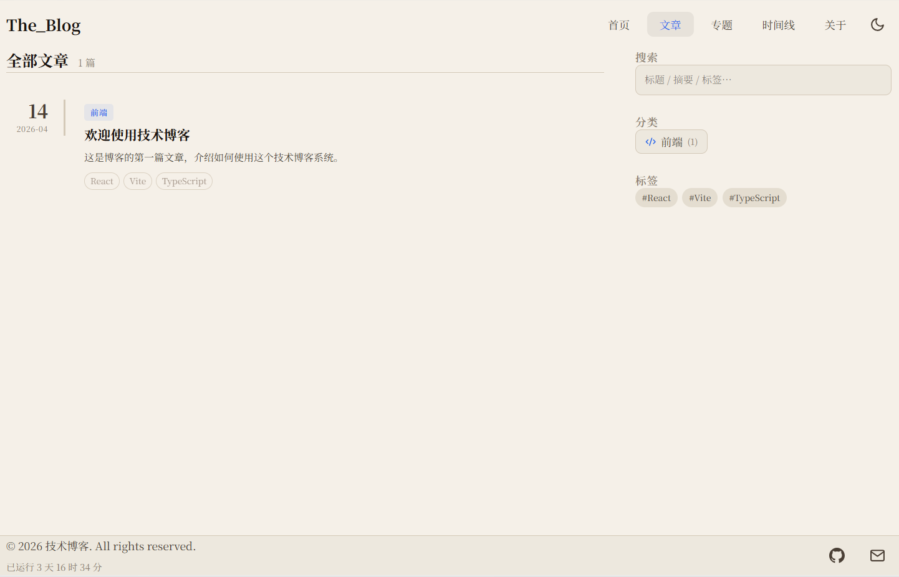

# The_Blog

一个基于 `React + Vite + TypeScript` 的个人技术博客项目，面向静态内容发布，支持 Markdown 写作、分类 / 标签 / 专题聚合、时间线浏览、RSS 订阅，以及带 ASCII 互动效果的 About 页面。

---

## 项目预览

> 当前使用仓库内置的占位预览图，后续可直接替换 `docs/images/` 下对应文件为真实截图。

| About 页 |
| --- |
|  | 

| 首页 | 
| --- | 
|  | 

| 文章页 | 
| --- |
|  | 
---

## 功能概览

- Markdown 文章驱动，内容放在 `posts/*.md`
- 自动解析 Frontmatter，生成文章元信息
- 首页最新文章展示
- 分类、标签、专题（Series）、时间线浏览
- 文章详情页支持：
  - GFM
  - 代码高亮
  - 目录 TOC
  - 阅读时长估算
- 明暗主题切换
- SEO 标题与描述自动更新
- 构建时自动生成 `rss.xml`
- `About` 页支持 ASCII 标题、信息卡片、粒子交互效果

---

## 技术栈

- `React 19`
- `Vite 6`
- `TypeScript 5`
- `React Router 7`
- `react-markdown`
- `remark-gfm`
- `rehype-slug`
- `rehype-highlight`
- `Tailwind CSS v4`
- `lucide-react`
- `@chenglou/pretext`（用于阅读时长估算辅助排版）

---

## 页面路由

当前已挂载的页面：

- `/`：首页
- `/posts`：文章列表
- `/posts/:slug`：文章详情
- `/categories/:category`：分类详情
- `/tags/:tag`：标签详情
- `/series`：专题列表
- `/series/:series`：专题详情
- `/timeline`：时间线
- `/about`：关于页

路由定义见：`src/App.tsx`

---

## 项目结构

```text
The_Blog/
├─ posts/                    # Markdown 文章
├─ public/                   # 静态资源
├─ src/
│  ├─ components/            # 通用组件
│  ├─ data/                  # 配置型数据
│  │  ├─ aboutAscii.ts
│  │  ├─ aboutCards.ts
│  │  ├─ categories.ts
│  │  └─ poems.ts
│  ├─ hooks/
│  ├─ layouts/
│  ├─ pages/                 # 页面组件
│  ├─ styles/
│  └─ utils/                 # 文章解析、阅读时长等工具
├─ dist/                     # 构建产物
├─ vite-plugin-rss.ts        # RSS 生成插件
├─ vite.config.ts            # Vite 配置
└─ README.md
```

---

## 本地开发

### 1. 安装依赖

```bash
npm install
```

### 2. 启动开发环境

```bash
npm run dev
```

默认端口：`3000`

### 3. 构建生产版本

```bash
npm run build
```

### 4. 本地预览构建结果

```bash
npm run preview
```

> 如果你在 Windows PowerShell 下遇到脚本执行限制，可以改用 `npm.cmd run dev`、`npm.cmd run build`。

---

## 如何写文章

在 `posts/` 目录下新建一个 `.md` 文件即可，例如：

```md
---
title: "欢迎使用 The_Blog"
date: "2026-04-14"
category: "前端"
tags: ["React", "Vite", "TypeScript"]
draft: false
summary: "这是一篇示例文章。"
updatedAt: "2026-04-18"
top: false
series: "博客搭建"
seriesOrder: 1
cover: "/images/example.png"
---

# 标题

正文内容……
```

### 支持的 Frontmatter 字段

| 字段 | 类型 | 说明 |
| --- | --- | --- |
| `title` | `string` | 文章标题 |
| `date` | `string` | 发布时间 |
| `category` | `string` | 分类 |
| `tags` | `string[]` | 标签 |
| `draft` | `boolean` | 是否草稿，`true` 时不会出现在正式列表和 RSS 中 |
| `summary` | `string` | 摘要 |
| `updatedAt` | `string` | 更新时间 |
| `top` | `boolean` | 是否置顶 |
| `series` | `string` | 所属专题 |
| `seriesOrder` | `number` | 专题内排序 |
| `cover` | `string` | 封面图地址 |

文章解析逻辑见：`src/utils/posts.ts`

---

## RSS

本项目已经接入 RSS。

### 生成方式

- 插件文件：`vite-plugin-rss.ts`
- 构建时自动生成：`dist/rss.xml`
- 站点入口已加入 RSS 自动发现标签：
  - `index.html`

### 相关配置

在 `vite.config.ts` 中配置：

```ts
rssPlugin({
  siteUrl: 'https://blog.bisheng.online',
  siteTitle: 'The_Blog',
  siteDescription: 'The_Blog is a personal blog about web development, programming, and technology.',
})
```

### 说明

- RSS 是**构建时生成**
- 草稿文章不会进入 RSS
- 实际部署前请确认 `siteUrl` 为你的真实站点地址

---

## 可配置数据

项目里把一些展示型内容抽到了 `src/data/`，方便集中维护：

### `src/data/categories.ts`

分类元数据：

- 分类图标
- 分类描述

适合修改博客的技术方向，例如：

- 前端
- 后端
- DevOps
- 云原生
- 数据库
- 网络安全
- AI
- Rust
- 移动端

### `src/data/poems.ts`

诗词/打字机文案数据，供侧边栏与展示区使用。

### `src/data/aboutAscii.ts`

About 页面顶部 ASCII 标题内容：

- `ASCII_NAME`
- `ASCII_FOR`
- `ASCII_ME`

### `src/data/aboutCards.ts`

About 页面信息卡片配置：

- 卡片 ASCII 边框
- 标签文案
- 展示值

---

## 文章页能力

文章详情页当前包含这些能力：

- `ReactMarkdown` 渲染 Markdown
- `remark-gfm` 支持表格、任务列表等语法
- `rehype-slug` 为标题自动生成锚点
- `CodeBlock` 渲染代码高亮
- `TOC` 自动提取 `##` / `###` 目录
- `estimateReadingTime()` 估算阅读时间

相关文件：

- `src/pages/PostDetail.tsx`
- `src/components/CodeBlock.tsx`
- `src/components/TOC.tsx`
- `src/utils/readingTime.ts`

---

## SEO 与主题

### SEO

通过 `src/hooks/useSEO.ts` 在页面切换时动态设置：

- `document.title`
- `meta[name="description"]`

### 主题切换

通过 `src/components/ThemeToggle.tsx` 在明暗主题之间切换，并持久化到 `localStorage`。

---

## About 页面说明

`/about` 页面除了普通介绍内容外，还包含：

- ASCII 标题动画
- 鼠标扰动效果
- Emoji 粒子系统
- 信息卡片点击爆裂效果

主要文件：

- `src/pages/About.tsx`
- `src/data/aboutAscii.ts`
- `src/data/aboutCards.ts`

---

## 部署建议

这是一个纯前端静态站点，构建完成后可直接部署到任意静态托管平台，例如：

- Vercel
- Netlify
- GitHub Pages
- Nginx 静态站点目录

部署时请注意：

1. 先执行 `npm run build`
2. 上传 `dist/` 目录
3. 确认 `vite.config.ts` 中的 `siteUrl` 正确
4. 确认你的托管环境支持 SPA 路由回退

---

## 后续可继续完善的方向

- 增加文章封面图与 Open Graph 信息
- 增加搜索索引或全文检索
- 增加文章分页 SEO 优化
- 挂载独立的分类总览 / 标签总览页
- 增加评论、访问统计、相关文章推荐

---

## 说明

当前 `README` 主要面向：

- 自己后续维护
- 快速回忆项目结构
- 新增文章或调整配置时快速定位文件

如果后面项目继续扩展，建议优先同步更新以下几部分：

- 路由
- `src/data/` 配置说明
- 文章 Frontmatter 字段
- RSS / 部署配置
